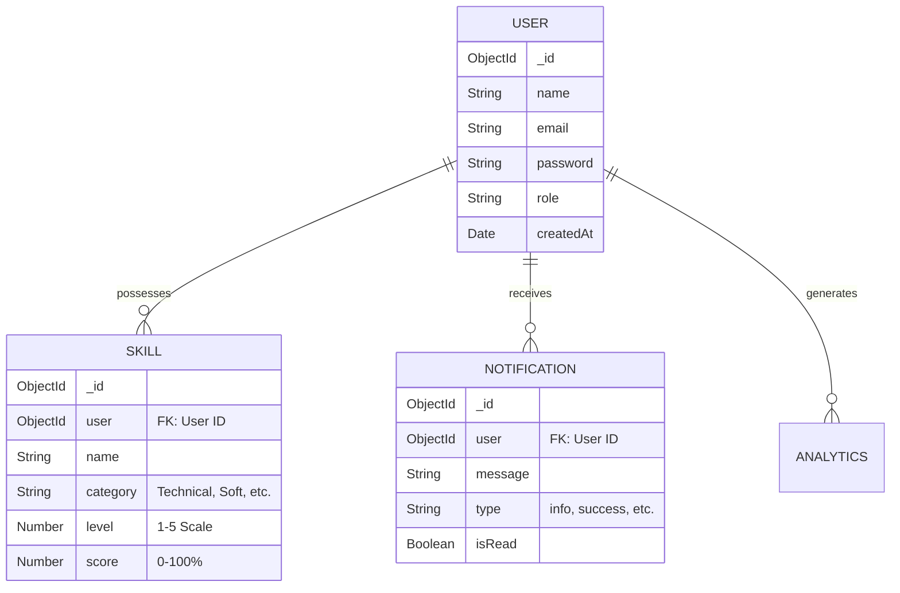

# Database Schema & Entity Design

## 1. Data Modeling Philosophy
We use **MongoDB** (via Mongoose) to handle our data. Our design focuses on a **User-Centric Model**, where skills and notifications are directly linked to a specific user ID for secure data isolation.

## 2. Entity Relationship Overview

## 3. Schema Definitions

### User Collection
Stores account information and authentication credentials.
- `name` (String, Required): Full name of the user.
- `email` (String, Required, Unique): Primary identifier for login.
- `password` (String, Required): Hashed using `bcrypt`.
- `role` (String, Default: 'user'): Supports administrative access control.

### Skill Collection (The Core Entity)
Tracks individual user proficiencies.
- `user` (ObjectId, Reference: 'User'): The owner of the skill.
- `name` (String, Required): e.g., "Node.js", "Leadership".
- `category` (String, Required): Facilitates grouping in UI (Technical/Soft Skill/Tool).
- `level` (Number, 1-5): Qualitative assessment (Novice to Master).
- `score` (Number, 0-100): Quantitative proficiency percentage.

### Notification Collection
Handles system alerts and recommendations.
- `user` (ObjectId, Reference: 'User'): Target recipient.
- `message` (String): The alert content.
- `type` (String): Controls styling in frontend (e.g., 'warning' for low scores).
- `isRead` (Boolean): Tracking for the notification bell.
