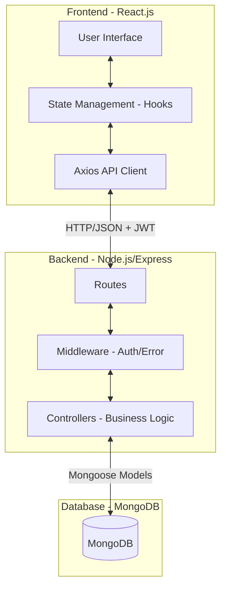

# Technology Stack & Architecture

## 1. Chosen Technology Stack: MERN
We have selected the **MERN (MongoDB, Express, React, Node)** stack for this project.

### Justification:
- **Single Language (JavaScript/JSX)**: Using JavaScript for both frontend and backend development streamlines the process, allowing for easier context switching and shared logic between the client and server.
- **JSON-based Communication**: MongoDB stores data in a JSON-like format (BSON), and Express/Node APIs naturally communicate via JSON. This eliminates complex mapping between data layers.
- **Scalability**: Node.js's non-blocking, event-driven architecture makes it highly scalable for handling multiple concurrent requests, such as real-time notifications or intense analytics calculations.
- **Component-Driven UI**: React.js allows us to build reusable, high-performance UI components (like the Radar Charts and Skill Bars used in our Dashboard).

## 2. System Architecture & Flow

The application follows a **Client-Server Architecture** with a clear separation of concerns.

### 🔄 System Flow Diagram

### Component Interaction:
1.  **Request**: The User interacts with the React UI. An API call is triggered via Axios.
2.  **Authentication**: The request includes a JWT (JSON Web Token) in the header. The backend `authMiddleware` verifies this token.
3.  **Processing**: The relevant Controller fetches or updates data using Mongoose models.
4.  **Response**: The server sends back a JSON response (e.g., skill list).
5.  **Re-render**: React updates the state and re-renders the charts and tables without a page reload.
